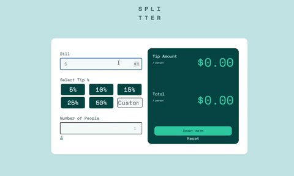

# Frontend Mentor - Tip calculator app solution

This is a solution to the [Tip calculator app challenge on Frontend Mentor](https://www.frontendmentor.io/challenges/tip-calculator-app-ugJNGbJUX). Frontend Mentor challenges help you improve your coding skills by building realistic projects.

## Table of contents

  - [The challenge](#the-challenge)
  - [Screenshot](#screenshot)
  - [Links](#links)
  - [My process](#my-process)
  - [Built with](#built-with)
  - [What I learned](#what-i-learned)
  - [Useful resources](#useful-resources)
  - [Author](#author)
  - [Acknowledgments](#acknowledgments)

### The challenge

Users should be able to:

- View the optimal layout for the app depending on their device's screen size
- See hover states for all interactive elements on the page
- Calculate the correct tip and total cost of the bill per person

### Screenshot



### Links

- Live Site URL: (https://phellwege.github.io/Tip_Calculator/)

### Built with

- Semantic HTML5 markup
- CSS custom properties
- Flexbox
- CSS Grid
- JavaScript

### What I learned

I learned how to keep my code as DRY as possible, by using a getID function. which really saved my bacon on length. It took a bit to get right, but it was really worth it.

```html
<h4>
  Bill
  <input class="forms" id="billMe" type="number" class="form-control" placeholder="0" name="0"/>
</h4>
<div id="buttons_form">
                <h4>
                Select Tip %
                </h4>
                <div>
                    <button class="button" id="five" value=".05" onClick="getId(this)"> 5% </button>
                    <button class="button" id="ten" value=".10" onClick="getId(this)"> 10% </button>
                    <button class="button" id="fifteen" value=".15" onClick="getId(this)"> 15% </button>
                </div>
                <div>
                    <button class="button" id="twentyFive" value=".25" onClick="getId(this)"> 25% </button>
                    <button class="button" id="fifty" value=".50" onClick="getId(this)"> 50% </button>
                    <input id="custom" type="number" class="form-control" placeholder="Custom" min="1" max="100" class="button" id="custom" onClick="getId(this)">
                </input>
                </div>
            </div>
```
```css
.button {
    background-color: hsl(183, 100%, 15%);
    color: hsl(189, 41%, 97%);
    width: 28%;
    padding: 1.5%;
    font-size: 24px;
    margin: 1%;
    border-radius: .25em;
    border: none;
    cursor: pointer;
}
.button:hover {
    background-color: hsl(185, 41%, 84%);
    color: hsl(183, 100%, 15%);
}
.button:active {
    background-color: hsl(172, 67%, 45%);
    color:hsl(183, 100%, 15%);
}
```
```js
function getId(btn) {
        const DeezeNuts = (btn.id)
        var billAmt = document.getElementById("billMe").value;
        var numOfPeople = document.getElementById("numberOfPeople").value;
        var tipPercent = document.getElementById(DeezeNuts).value;
        CalcTip(billAmt, tipPercent, numOfPeople)
    }
```

### Useful resources

- [W3Schools](https://www.w3schools.com/) - This has always been one of my go to's for any project that I have a minor question on.
- [Stack Overflow](https://stackoverflow.com/) - Stack overflow is an amazing resource where most of the questions that you could possibly have, have already been answered.

## Author

- Website - [Peter Hellwege](http://peters-portfolio.net/)
- Frontend Mentor - [@phellwege](https://www.frontendmentor.io/profile/yourusername)

## Acknowledgments

I was introduced to Frontend Mentor by Brendan Sullivan, whom I attended a coding bootcamp with. 

